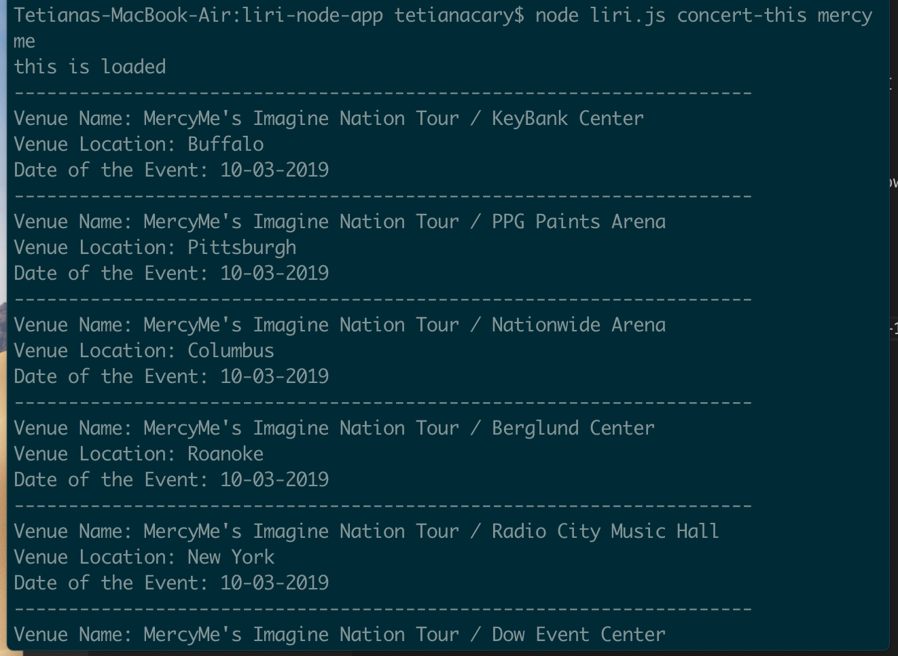
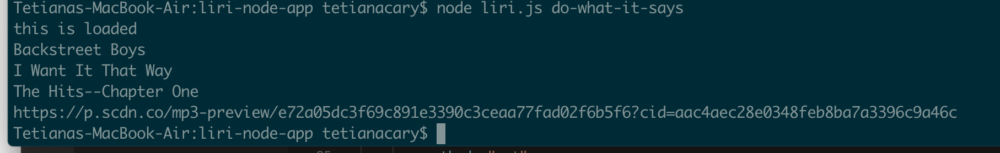
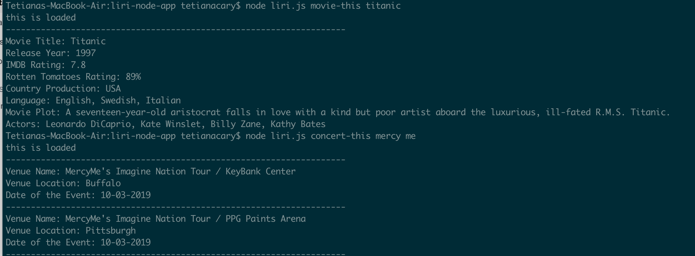
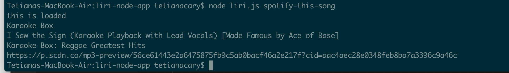
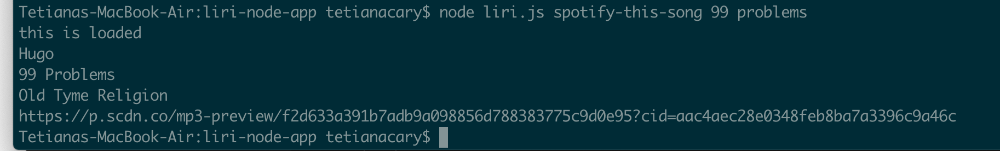

# liri-node-app
LIRI is like iPhone's SIRI. However, while SIRI is a Speech Interpretation and Recognition Interface, LIRI is a Language Interpretation and Recognition Interface. LIRI will be a command line node app that takes in parameters and gives you back data.
I used :
Node-Spotify-API
Axios
Also used Axios to grab data from the OMDB API and the Bands In Town API
Moment
DotEnv

Try it so liri.js can take in one of the following commands:
* concert-this
* spotify-this-song
* movie-this
* do-what-it-says

HERE is an example of concert-this command.

HERE is an example of do-what-it-says command.

HERE is an example of movie-this command.

HERE is an example of spotify-default command.

HERE is an example of spotify-this-song command.
